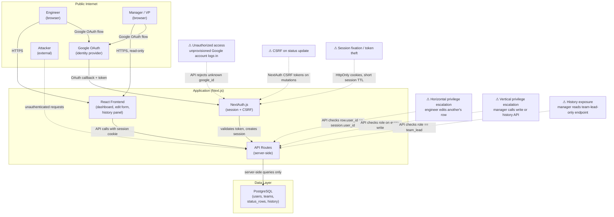

# Architecture

## Nouns and Verbs

**Nouns:**
- **User** — a person with a Google identity, assigned a role and team by the team lead
- **Team** — a named group of engineers; the unit of dashboard visibility
- **StatusRow** — one engineer's current status; there is exactly one per engineer per team
- **StatusSnapshot** — an immutable record of what a StatusRow contained at the moment it was saved; the history

**Verbs:**
- `update_status` — an engineer saves their own StatusRow; creates a StatusSnapshot
- `view_board` — anyone reads current StatusRows for their accessible teams
- `view_history` — a team lead reads StatusSnapshots for a specific engineer

These six words describe the entire system. If a proposed feature doesn't fit neatly into this vocabulary, it's probably out of scope.

## Components

### Frontend (Next.js + React)

**Dashboard page** — the main view. Teams appear as named sections with a divider between them. Each section lists engineers with their StatusRow. Rows stale for more than 2 days are visually dimmed (reduced opacity). The page polls every 60 seconds for updates; on tab focus it refetches immediately.

**Edit form** — inline or modal; appears only on the viewer's own row. Fields: primary focus (text, 140-char limit with counter), status dropdown, blockers (optional text), Jira reference (optional text). Save is immediate with optimistic UI.

**History panel** — a slide-in drawer accessible to team leads only; shows the 20 most recent snapshots for an engineer, in reverse chronological order.

**Admin page** — accessible to team leads; allows adding/removing team members and assigning roles. No self-serve role changes.

### API (Next.js API Routes)

All routes are server-side; the database is never exposed directly to the browser.

| Route | Method | Who | What |
|---|---|---|---|
| `/api/dashboard` | GET | All authenticated | Current rows for accessible teams |
| `/api/status` | PUT | Engineer / Team Lead | Update caller's own row |
| `/api/history/[userId]` | GET | Team Lead only | Snapshots for a team member |
| `/api/admin/users` | POST/DELETE | Team Lead only | Add/remove team members, assign roles |

Server-side role checks on every request — no client-side enforcement.

### Auth (NextAuth.js + Google OAuth)

Google Workspace OAuth 2.0. On first login, NextAuth creates a session; the API checks whether the Google account maps to a known user in the `users` table. Unknown accounts get a "not provisioned" error — there's no self-signup. Sessions include role and team IDs to avoid a DB lookup on every request.

### Database (PostgreSQL)

```sql
users         (id, google_id, email, name, role, created_at)
teams         (id, name, created_at)
team_members  (user_id, team_id)               -- engineers on a team
manager_teams (user_id, team_id)               -- which teams a manager can read
status_rows   (id, user_id, team_id, primary_focus, status, blockers, jira_ref, updated_at)
status_history(id, status_row_id, primary_focus, status, blockers, jira_ref, captured_at)
```

`status_history` rows are written by the API on every successful `PUT /api/status` — before overwriting the current row. No triggers; application-level.

## Key Technology Decisions

**Full-stack Next.js, no separate API service.** The app is simple enough that splitting into two deployed services adds operational overhead with no benefit. One deploy, one set of environment variables, one place to look when something breaks.

**Polling, not WebSockets.** A 7-person team updating status a few times a day does not need real-time push. 60-second polling with an on-focus refetch is indistinguishable from real-time for this use case and is far simpler to build and operate.

**Application-layer history capture.** Writing to `status_history` in the same transaction as the `status_rows` update keeps history consistent without triggers or CDC. Simple and auditable.

**Hosting: Railway.** Railway runs a persistent Node.js process, so Next.js manages its own connection pool to Postgres natively — no external pooler needed. One service, one Postgres instance, one team member can own the entire deployment without devops support. Environment variables: `DATABASE_URL`, `NEXTAUTH_SECRET`, `NEXTAUTH_URL`, `GOOGLE_CLIENT_ID`, `GOOGLE_CLIENT_SECRET`.

## Cross-Cutting Concerns

**Security:** Role checks are server-side on every API request. Session tokens are HttpOnly cookies managed by NextAuth. The database is not publicly accessible. See threat model below.

**Staleness:** Computed at render time — no scheduled jobs. The frontend calculates `Date.now() - row.updated_at` and applies dim styling if > 48 hours.

**Operability:** Single deployable unit. Environment variables: `DATABASE_URL`, `NEXTAUTH_SECRET`, `GOOGLE_CLIENT_ID`, `GOOGLE_CLIENT_SECRET`. Logs via the hosting platform's standard output. No external dependencies at runtime beyond Postgres and Google OAuth.

## Threat Model



